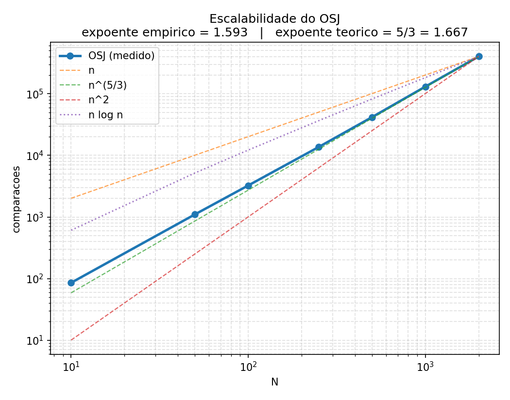
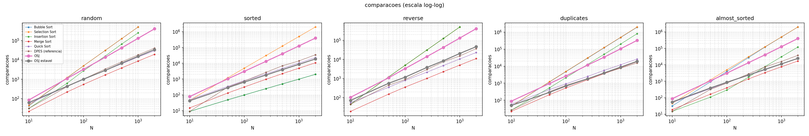
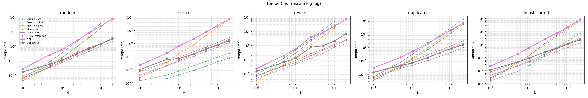

# OSJ — Ordenação por Sondagem e Janelas

**Trabalho Prático 1 — Análise e Projeto de Algoritmos**
Alunos: Bruno da Silva Rocha · Pietro M. Prauchner

---

## Resumo

O **OSJ** é um método de ordenação autoral construído sobre uma separação deliberada de responsabilidades entre duas fases:

- **Fase 1 — Sondagem:** cada elemento estima o próprio posto final consultando `s` "testemunhas" sorteadas do vetor e salta direto para a posição estimada. É uma fase puramente **heurística e aleatorizada**: ela pode errar.
- **Fase 2 — Sanfona:** uma janela de largura `w` varre o vetor com passo `w/2`, ordenando por inserção cada trecho coberto, até uma varredura inteira ocorrer sem nenhuma movimentação. É a fase **determinística** que ordena qualquer entrada sozinha.

A tese central do projeto é que **a Fase 1 não pode errar de modo fatal, apenas de modo caro**. Toda a corretude mora na Fase 2; a Fase 1 responde só pelo desempenho. Isso permite empregar uma heurística agressiva e aleatória sem qualquer risco de saída incorreta.

Com os parâmetros equilibrados em `s = w = Θ(n^{2/3})`, o custo esperado é **Θ(n^{5/3})** — uma classe intermediária entre `n log n` e `n²`. O expoente empírico medido foi **1,59**, contra **1,667** previsto pela dedução.

---

## Como executar

```bash
uv sync                              # monta o ambiente a partir do uv.lock

cd python
uv run python test_osj.py -v         # suíte completa: 44 testes
uv run python student_template.py    # interface exigida pelo enunciado
uv run python exemplo_didatico.py    # exemplo numérico passo a passo
uv run python scaling_osj.py         # escalabilidade: expoente + gráfico log-log
uv run python benchmark_osj.py       # benchmark completo + gráficos em ../resultados/
```

O algoritmo e a suíte de testes **não têm dependência alguma** além da biblioteca
padrão: `python test_osj.py` roda num Python 3.11 limpo, sem `uv`. O ambiente
existe por causa do `matplotlib`, usado só na geração dos gráficos — e o
`uv.lock` fixa as versões exatas para que as medições relatadas aqui se
reproduzam.

---

## 1. Concepção e raciocínio projetual

### 1.1 A intuição

Os métodos clássicos por comparação descobrem a posição de um elemento **comparando-o repetidamente com os outros**. O Insertion Sort desliza cada elemento até seu lugar; o Selection Sort varre o resto do vetor para achar o mínimo. Em todos, a informação sobre "onde este elemento deve ficar" é construída aos poucos, por contato direto.

A pergunta que originou o OSJ foi: **e se cada elemento pudesse estimar sua posição final por amostragem, sem falar com todo mundo?**

A metáfora é uma eleição com pesquisa de boca de urna. Para saber sua colocação exata num grupo de mil pessoas, você precisaria comparar-se com as 999 restantes. Mas se você perguntar a **quarenta pessoas sorteadas** quantas são menores que você e trinta responderem que sim, você conclui com boa confiança que está por volta do percentil 75 — e pode ir direto para lá. A estimativa não é exata, mas custa 40 perguntas em vez de 999, e o erro é **quantificável**.

Daí vem a Fase 1. E daí vem imediatamente o problema: o vetor resultante fica *quase* ordenado, não ordenado. Alguém precisa consertar os erros residuais.

### 1.2 O reparo: por que janelas, e por que sobrepostas

O conserto precisa ser **local**, porque os erros são locais: a sondagem não teleporta um elemento para o outro extremo do vetor, ela o coloca perto do lugar certo. Um reparo que reexamine o vetor inteiro desperdiçaria a informação que a Fase 1 comprou.

Daí a metáfora da sanfona: uma janela de largura `w` percorre o vetor como uma onda, alisando localmente o que passa embaixo dela, e repete o movimento até que uma passada inteira não encontre mais nada para alisar.

A decisão de projeto mais importante do método está no **passo** dessa janela. Se as janelas forem disjuntas (passo `w`), o processo adquire **pontos fixos espúrios** — estados estáveis que não são o vetor ordenado:

```
A = [3, 4, 1, 2],  w = 2,  passo = 2

  janela [0:2] = [3, 4]  →  já ordenada, nada acontece
  janela [2:4] = [1, 2]  →  já ordenada, nada acontece
  nenhuma movimentação → o algoritmo encerra

  Saída: [3, 4, 1, 2]   ← ERRADO
```

Não é um azar isolado: `[4,5,6,1,2,3]` com `w=3` falha do mesmo modo, e a construção se generaliza para qualquer bloco internamente ordenado na posição errada — é uma família infinita de falhas.

Com **passo `w/2`**, as janelas se sobrepõem e todo par de posições vizinhas `(k, k+1)` passa a estar contido em alguma janela. Isso elimina todos os pontos fixos exceto um:

> **O único ponto fixo do processo com janelas sobrepostas é o vetor ordenado.**

Essa é a razão de o algoritmo funcionar, e o contraexemplo acima está codificado como teste automatizado em `test_osj.py::TestTheory::test_disjoint_windows_have_spurious_fixed_points`.

### 1.3 A separação de responsabilidades

| | responsabilidade | pode falhar? | consequência de falhar |
| :--- | :--- | :--- | :--- |
| **Fase 1** | desempenho | sim, é aleatória | a Fase 2 fica mais cara |
| **Fase 2** | corretude | não, é determinística | — |

Consequência prática: a aleatoriedade da sondagem **nunca** produz saída errada. Para tornar isso verificável e não apenas argumentável, o código expõe `sanfona_sort()` — o algoritmo *sem* a Fase 1 — e a suíte de testes roda **todos os cenários obrigatórios contra ela**, além de um teste que sabota deliberadamente a sondagem (`s = 1`, uma única testemunha) e confirma que a saída continua perfeita.

---

## 2. Especificação formal

### 2.1 Pseudocódigo

```
ALGORITMO OSJ(A, s, w)
  Entrada: vetor A de n elementos comparáveis; s ≥ 1; w ≥ 2
  Saída:   permutação ordenada de A

  se n ≤ 1 então devolva A                      // casos limite N=0 e N=1

  ─── FASE 1: SONDAGEM ────────────────────────────────────────────
  para i ← 0 até n−1 faça
      c ← 0
      repita s vezes
          j ← inteiro aleatório uniforme em [0, n−1]
          se A[j] < A[i] então c ← c + 1
      p̂[i] ← ⌊ (c / s) · (n−1) ⌋                // posição estimada
  B ← distribuição estável de A pelos valores de p̂   // resolve colisões

  ─── FASE 2: SANFONA ─────────────────────────────────────────────
  w ← max(2, min(w, n))                          // janela nunca excede o vetor
  passo ← ⌊w / 2⌋
  inícios ← { 0, passo, 2·passo, … } ∪ { n − w } // a última encosta na borda

  repita
      movimentou ← falso
      para cada p em inícios faça
          se INSERÇÃO(B, p, p+w) moveu algo então movimentou ← verdadeiro
      até movimentou = falso

  devolva B
```

A rotina `INSERÇÃO` é a ordenação por inserção clássica restrita ao intervalo, com comparação estrita (`B[j] > chave`), o que a torna estável e — crucialmente para a análise — faz com que **só troque elementos vizinhos**.

### 2.2 Exemplo numérico passo a passo

Entrada com 12 elementos, `s = 4`, `w = 4`. O rastro abaixo é a saída real de `exemplo_didatico.py`, não uma ilustração idealizada.

```
Entrada  : [42, 7, 19, 88, 3, 61, 25, 54, 12, 77, 33, 96]
Ordenado : [3, 7, 12, 19, 25, 33, 42, 54, 61, 77, 88, 96]
Inv(A) inicial = 24   |   deslocamento máximo = 7
```

**Fase 1 — cada elemento consulta 4 testemunhas:**

```
  valor |        testemunhas sorteadas |   c |    c/s |  posição
  ------------------------------------------------------------------
     42 |             [54, 19, 96, 77] |   1 |    1/4 |        2
      7 |              [3, 88, 96, 25] |   1 |    1/4 |        2
     19 |              [96, 3, 12, 88] |   2 |    2/4 |        5
     88 |             [33, 96, 54, 61] |   3 |    3/4 |        8
      3 |             [25, 12, 96, 77] |   0 |    0/4 |        0
     61 |              [88, 3, 12, 96] |   2 |    2/4 |        5
     25 |              [61, 12, 7, 96] |   2 |    2/4 |        5
     54 |             [88, 96, 96, 54] |   0 |    0/4 |        0
     12 |             [96, 33, 19, 12] |   0 |    0/4 |        0
     77 |             [88, 25, 42, 61] |   3 |    3/4 |        8
     33 |              [33, 25, 54, 7] |   2 |    2/4 |        5
     96 |             [96, 96, 19, 61] |   2 |    2/4 |        5

  Vetor após a Fase 1: [3, 54, 12, 42, 7, 19, 61, 25, 33, 96, 88, 77]
  Inv(A) = 16 (era 24)   |   deslocamento máximo = 6 (era 7)
```

Repare no elemento `54`, que sorteou `[88, 96, 96, 54]` e não encontrou nenhuma testemunha menor: estimou `c/s = 0` e foi parar na posição 0. **A Fase 1 errou feio com ele** — e o algoritmo continua correto, porque a Fase 2 conserta.

**Fase 2 — janelas de largura 4 com passo 2:**

```
  Passada 1:
    janela [ 0: 4]  [3, 54, 12, 42]  -> [3, 12, 42, 54]     <- ordenou
    janela [ 2: 6]  [42, 54, 7, 19]  -> [7, 19, 42, 54]     <- ordenou
    janela [ 4: 8]  [42, 54, 61, 25] -> [25, 42, 54, 61]    <- ordenou
    janela [ 6:10]  [54, 61, 33, 96] -> [33, 54, 61, 96]    <- ordenou
    janela [ 8:12]  [61, 96, 88, 77] -> [61, 77, 88, 96]    <- ordenou
    estado: [3, 12, 7, 19, 25, 42, 33, 54, 61, 77, 88, 96]   Inv = 2

  Passada 2:
    janela [ 0: 4]  [3, 12, 7, 19]   -> [3, 7, 12, 19]      <- ordenou
    janela [ 2: 6]  [12, 19, 25, 42] -> [12, 19, 25, 42]
    janela [ 4: 8]  [25, 42, 33, 54] -> [25, 33, 42, 54]    <- ordenou
    janela [ 6:10]  [42, 54, 61, 77] -> [42, 54, 61, 77]
    janela [ 8:12]  [61, 77, 88, 96] -> [61, 77, 88, 96]
    estado: [3, 7, 12, 19, 25, 33, 42, 54, 61, 77, 88, 96]   Inv = 0

  Passada 3:
    (nenhuma janela move nada) -> PONTO FIXO, encerra

Saída: [3, 7, 12, 19, 25, 33, 42, 54, 61, 77, 88, 96]
Totais: 106 comparações, 118 movimentações, 16 trocas de vizinhos, 3 passadas
```

Note a **passada 3**: ela não muda nada, mas é obrigatória. É ela que *constata* o ponto fixo. O algoritmo não pode saber que terminou sem gastar uma varredura confirmando.

E note a coincidência que não é coincidência: **16 trocas de vizinhos** e `Inv = 16` ao início da Fase 2. A seção seguinte explica por quê.

---

## 3. Corretude

### 3.1 Término

> **Teorema.** A Fase 2 termina após um número finito de passadas, para qualquer entrada e qualquer `w ≥ 2`.

Define-se a **função potencial**

$$\mathrm{Inv}(A) = \#\{(i,j) : i < j \text{ e } A[i] > A[j]\}$$

o número de pares fora de ordem. Trata-se de uma grandeza **da análise, não do algoritmo**: ela não é calculada em lugar nenhum do código, e calculá-la custaria mais caro do que desfazer a desordem que ela mede. O algoritmo usa em seu lugar o sinal barato `movimentou`, de custo `O(1)`.

**Passo 1.** `Inv(A)` é um inteiro não-negativo: é a cardinalidade de um conjunto finito de pares.

**Passo 2.** Cada movimentação elementar reduz `Inv(A)` em **exatamente 1**. A inserção dentro da janela só troca posições **vizinhas** `k` e `k+1`, e apenas quando `A[k] > A[k+1]`. O par `(k, k+1)` deixa de ser inversão: −1. Qualquer outro par envolve um elemento numa posição `m ∉ {k, k+1}`, que não se move; se `m < k` ele precedia ambos e continua precedendo, se `m > k+1` ele sucedia ambos e continua sucedendo, e **não existe posição estritamente entre `k` e `k+1`**. Como nem os valores nem a ordem posicional relativa desses pares mudaram, seus status são preservados.

> A adjacência é essencial. Uma troca a distância `d` alteraria até `2d − 1` pares de uma vez, e o efeito sobre o potencial deixaria de ser unitário e previsível.

**Passo 3.** Inicialmente `Inv(A) ≤ n(n−1)/2`, pois esse é o número total de pares, e o máximo é atingido exatamente pelo **vetor estritamente reverso** — que é, não por acaso, o cenário de estresse da suíte obrigatória.

**Passo 4.** Toda passada que não encerra o laço executa ao menos uma movimentação, logo reduz `Inv(A)` em ao menos 1. Se houvesse infinitas passadas com movimentação, `Inv(A)` se tornaria negativo, contradizendo o Passo 1. Logo ocorrem no máximo `n(n−1)/2` passadas com movimentação, e a passada seguinte encerra o laço. ∎

> **Corolário (fórmula fechada para movimentações).** Como cada troca desfaz exatamente uma inversão e nenhuma inversão é criada, o número total de trocas de vizinhos em toda a execução é **exatamente `Inv(A₀)`**, onde `A₀` é o vetor no início da Fase 2 — e portanto no máximo `n(n−1)/2 = O(n²)`.

Isso é verificado experimentalmente como **igualdade exata**, não apenas como limite, em `test_osj.py::TestTheory::test_potential_function_bound_on_swaps`.

### 3.2 Corretude no ponto fixo

> **Teorema.** Se uma passada completa não produz nenhuma movimentação, o vetor está ordenado.

**Prova.** Nenhuma movimentação na passada inteira significa que **nada se moveu**, logo todas as janelas estavam simultaneamente ordenadas no início da passada e assim permaneceram. (Essa simultaneidade é o ponto delicado: numa passada comum, ordenar uma janela pode desarrumar a região de sobreposição da anterior. A preocupação desaparece exatamente quando não há movimentação.)

Tome agora um par de posições vizinhas `(k, k+1)` qualquer. Uma janela iniciada em `p` cobre `[p, p+w−1]`, portanto contém o par se e somente se `p ≤ k` e `p + w − 1 ≥ k + 1`, isto é

$$k + 2 - w \;\le\; p \;\le\; k$$

um intervalo de comprimento `w − 1`. Como os inícios de janela são múltiplos de `⌊w/2⌋ ≤ w − 1` (para `w ≥ 2`), sempre existe um início dentro desse intervalo, complementado pela janela final encostada na borda direita. Logo **todo par vizinho está contido em alguma janela**, que estava ordenada, donde `A[k] ≤ A[k+1]` para todo `k`. Um vetor cujos pares vizinhos estão todos em ordem está ordenado. ∎

O intervalo de comprimento `w − 1` mostra que o passo máximo admissível é `w − 1`; a escolha `w/2` é conservadora e favorece a convergência em menos passadas.

---

## 4. Análise assintótica

**Convenções desta seção.** O OSJ é aleatorizado, e cotas de um método aleatorizado só significam alguma coisa quando o regime probabilístico está dito. Três fixações valem para tudo o que segue.

**1. Sobre o que a esperança é tomada.** A esperança é sobre a aleatoriedade da **Sondagem** — o sorteio das testemunhas —, e **não** sobre uma distribuição de entradas. A afirmação é a forte:

$$\mathbb{E}\big[T(n)\big] \;=\; \Theta\!\left(n^{5/3}\right) \qquad \text{para toda entrada de tamanho } n$$

— **toda** entrada, não uma entrada média.

Ela é mais forte que o "caso médio" clássico do Quick Sort, que é uma média sobre permutações aleatórias da entrada. O que a licencia é que a distribuição do erro de estimativa não olha para a ordem da entrada: `X_i ~ Binomial(s, p_i)` depende apenas de `p_i = r_i/n`, isto é, do **posto** de `A[i]`, e a família dos postos é `{0, …, n−1}` seja qual for a permutação recebida. Nenhum passo da §4.1 usa hipótese sobre a entrada. Isso é corroborado experimentalmente pela §6.4: `sorted` 397.562, `random` 402.550, `reverse` 409.441 comparações para `N = 2000` — 3% de espalhamento entre a entrada mais favorável e a mais hostil aos métodos quadráticos. Aquela seção lê o dado como **limitação** (o OSJ não é adaptativo, e não colhe o `Θ(n)` que Insertion colhe no vetor ordenado); aqui ele é lido pela outra face, que é a favorável: a insensibilidade à ordem da entrada é exatamente a evidência de que a cota vale uniformemente, e não em média sobre entradas.

**2. De onde vem o `Θ`.** A soma da §4.3 é `Θ(ns) + O(n²/√s)`, e uma soma de `Θ` com `O` é um `O` — sozinha ela dá cota superior, não `Θ`. A cota inferior é **própria e incondicional**, e vem da Fase 1: a Sondagem faz exatamente `n·s` comparações e `n` movimentações, sem olhar para nada, logo `T(n) ≥ Θ(n·s) = Ω(n^{5/3})` em **toda** execução — não só em esperança. É o mesmo fato que a §4.4 usa para o melhor caso `Ω(n^{5/3})`. As duas pontas juntas fecham o `Θ`.

Explicitando as três parcelas da cota superior em esperança, para que se veja qual delas é probabilística:

| parcela | cota | de onde vem |
| :--- | :--- | :--- |
| Fase 1 | `Θ(n·s) = Θ(n^{5/3})` | determinística, exata |
| varredura das janelas | `Θ(n)·P = O(n^{4/3})` | determinística: `Dis_esq(A₀) ≤ n − 1` sempre, logo `P = O(n/w)` pelo lema do avanço (§4.2) |
| trocas de vizinhos | `E[Inv(A₀)] = O(n²/√s) = O(n^{5/3})` | **única parcela probabilística**; ver o parágrafo abaixo |

A parcela probabilística usa a desigualdade elementar `Inv(A) ≤ d₁ + … + dₙ`, onde `dᵢ` é o deslocamento do `i`-ésimo elemento em relação ao seu posto (toda inversão tem ao menos um dos dois elementos deslocado, e cada elemento é contado uma vez por unidade de deslocamento). Aplicando **linearidade da esperança** e a estimativa de erro típico da §4.1, `E[dᵢ] = O(n/√s)`, vem `E[Inv(A₀)] = O(n²/√s)`. É uma soma, não um máximo — por isso ela não precisa de Hoeffding, e por isso o regime de esperança sai mais barato que o de alta probabilidade. Note também que o termo de varredura é dominado em qualquer regime: mesmo com a estimativa mais pessimista possível de `Dis_esq`, ele fica em `O(n^{4/3}) = o(n^{5/3})`.

**3. Os dois regimes, lado a lado.** As duas cotas abaixo são afirmações diferentes, e a §4.4 passa a enunciar as duas:

| regime | cota | parâmetros | instrumento |
| :--- | :--- | :--- | :--- |
| **esperança** (sobre a Sondagem, para toda entrada) | `E[T(n)] = Θ(n^{5/3})` | `s = w = Θ(n^{2/3})` | variância de `p̂_i` (§4.1) |
| **alta probabilidade** (`1 − n^{−c}`, para toda entrada) | `T(n) = O(n^{5/3}(log n)^{1/3})` | `s = w = Θ(n^{2/3}(log n)^{1/3})` | Hoeffding + cota da união (§4.1) |

A segunda linha é um fator `(log n)^{1/3}` mais cara, e a diferença é estrutural: para valer *simultaneamente* para os `n` elementos, a cota da união cobra `ε = Θ(√(log n / s))` em vez de `Θ(1/√s)`, o que infla o deslocamento para `D = O(n√(log n/s))`. Reotimizando `s` com esse `D` — minimizar `n·s + n²(log n)^{1/2}·s^{−1/2}` dá `s^{3/2} = Θ(n (log n)^{1/2})`, isto é `s = Θ(n^{2/3}(log n)^{1/3})` — chega-se a `T = Θ(n·s) = O(n^{5/3}(log n)^{1/3})`. **Fixados os parâmetros da implementação** (`s = w = Θ(n^{2/3})`, ADR-0002), a mesma conta dá `O(n^{5/3}(log n)^{1/2})`; o `(log n)^{1/3}` é a cota do regime com os parâmetros ajustados a ele. O código mantém `Θ(n^{2/3})`: é o ótimo do regime de esperança, que é o regime em que o algoritmo é reivindicado, e a diferença é um fator sublogarítmico que nenhum experimento nesta escala distingue.

O pior caso (§4.3) é a terceira afirmação, e vive no complemento desses eventos: `O(n²)`, cota superior e não `Θ`, atingível apenas se a Sondagem devolver `Inv(A₀) = Θ(n²)`.

Nada aqui reabre a escolha de variante (ADR-0001, sondagem independente) nem a de parâmetros (ADR-0002).

### 4.1 Fase 1 — análise probabilística

Seja `r_i` o posto verdadeiro de `A[i]` (número de elementos estritamente menores) e `p_i = r_i / n`. Cada testemunha é sorteada uniformemente, logo

$$X_i \sim \mathrm{Binomial}(s,\, p_i), \qquad \hat{p}_i = X_i/s, \qquad \mathbb{E}[\hat{p}_i] = p_i$$

**Custo.** Exatamente `n·s` comparações e `n` movimentações: **Θ(n s)**, independente da entrada.

**Erro típico.** $\mathrm{Var}(\hat p_i) = p_i(1-p_i)/s \le 1/(4s)$, portanto o desvio típico da estimativa é `O(1/√s)` e o deslocamento típico em posições é

$$\mathbb{E}\,|\hat{p}_i - p_i| \cdot n \;=\; O\!\left(\frac{n}{\sqrt{s}}\right)$$

**Erro máximo (alta probabilidade).** Pela desigualdade de Hoeffding,

$$\Pr\big[\,|\hat{p}_i - p_i| \ge \varepsilon\,\big] \;\le\; 2e^{-2s\varepsilon^{2}}$$

Aplicando união sobre os `n` elementos e tomando $\varepsilon = \sqrt{\ln(2n/\delta) / (2s)}$, com probabilidade ao menos `1 − δ` **todas** as estimativas ficam dentro de `ε`.

**Do erro de estimativa ao deslocamento.** Se todas as estimativas estão dentro de `ε`, dois elementos `i` e `j` só podem sair trocados entre si se `|p_j − p_i| ≤ 2ε`. Existem no máximo `2εn` elementos nessa faixa, logo o deslocamento de cada elemento em relação à sua posição verdadeira satisfaz

$$D \;\le\; 2\varepsilon n \;=\; O\!\left(n\sqrt{\frac{\log n}{s}}\right) \quad\text{com alta probabilidade}$$

### 4.2 Fase 2 — custo em função da desordem recebida

Cada janela custa `Θ(w)` comparações de varredura mais uma comparação por troca de vizinhos. Com `2n/w` janelas por varredura:

- **comparações por varredura:** `Θ(n)` mais as trocas de vizinhos daquela varredura;
- **total de trocas de vizinhos em todas as varreduras:** exatamente `Inv(A₀)`, pelo corolário da Seção 3.1;
- **número de varreduras:** dado pelo **lema do avanço**, abaixo.

#### Lema do avanço

Seja o **deslocamento à esquerda** do vetor

$$\mathrm{Dis}_{\text{esq}}(A) \;=\; \max_{x}\ \big(\mathrm{pos}(x) - \mathrm{posto}(x)\big)^{+}$$

o maior número de posições que algum elemento ainda precisa recuar. Ele é dominado pelo deslocamento `D` da Seção 4.1, que limita o erro nos dois sentidos.

> **Lema (avanço).** Se `Dis_esq(A) = d` no início de uma varredura, então ao fim dela `Dis_esq ≤ max(0, d − ⌊w/2⌋)`.

**Premissas** — as duas primeiras são conjuntas, e nenhuma delas sozinha basta:

1. **Sobreposição.** Inícios de janela consecutivos distam no máximo o passo `⌊w/2⌋` — inclusive o par formado pela última janela encostada na borda direita e a anterior.
2. **Ordem crescente.** A varredura processa os inícios da esquerda para a direita. É por isso que a janela que carrega um elemento para a esquerda é a que **começa antes** dele, e não a que começa na posição dele.
3. Cada janela sai internamente ordenada (a inserção dentro da janela é completa).

**Redução a um vetor 0/1.** Fixe `m` e pinte de **1** os `m` menores elementos e de **0** os demais. Como todo 1 precede todo 0, ordenar uma janela equivale a **compactar seus 1s no extremo esquerdo dela**. Logo nenhum 1 jamais anda para a direita, e a posição `R_m` do 1 mais à direita é não-crescente ao longo da varredura. Além disso

$$\mathrm{Dis}_{\text{esq}}(A) \;=\; \max_{m}\ \big(R_m - (m-1)\big)$$

— tomando `m = posto(x) + 1` recupera-se o deslocamento de cada `x`, e `R_m` é sempre a posição de um elemento de posto `≤ m − 1`. Basta então provar, para cada `m`:

> uma varredura leva `R_m` para no máximo `max(m − 1, R_m − ⌊w/2⌋)`.

**Prova.** Escreva `passo = ⌊w/2⌋` e seja `ρ` a posição do 1 mais à direita **ao fim** da varredura. Se `ρ = m − 1`, os `m` uns ocupam o prefixo e não há o que provar. Caso contrário há um 0 à esquerda de `ρ`; seja `u` a menor posição tal que `[u, ρ]` contenha só 1s ao fim da varredura. Então `u ≥ 1` e a posição `u − 1` contém um 0.

**Passo 1 — cobertura.** Este é o argumento da Seção 3.2, reaproveitado: a mesma sobreposição que sustenta a corretude sustenta o avanço. Seja `W_v = [v, v+w)` a **última** janela da varredura que contém a posição `u − 1`, e `v'` o início seguinte. Por maximalidade de `v` vale `v' > u − 1`; por cobertura, `v' ≤ v + passo`. Logo

$$v \;\ge\; v' - \text{passo} \;\ge\; u - \text{passo}
\qquad\Longrightarrow\qquad
v + w \;\ge\; u + w - \text{passo} \;\ge\; u + \text{passo}$$

**É essa meia janela sobrando à direita de `u` que vira o avanço.** (O início seguinte existe: se `W_v` fosse a última janela, nada além dela tocaria as posições `≥ u − 1`, que ficariam congeladas como `W_v` as deixou — e `ρ ≥ u` contradiz o próximo passo.)

**Passo 2 — o que `W_v` deixa para trás.** Pela ordem crescente, toda janela processada depois de `W_v` começa à direita de `u − 1`; logo a posição `u − 1` nunca mais é tocada e já continha 0 ao fim de `W_v`. Como `W_v` sai com seus 1s compactados à esquerda, um 0 em `u − 1` obriga **todas** as posições `[u − 1, v+w)` a conterem 0 naquele instante.

**Passo 3 — assimetria.** Um 1 nunca anda para a direita. Portanto cada um dos `ρ − u + 1` uns que ocupam `[u, ρ]` ao fim da varredura estava, imediatamente após `W_v`, em alguma posição `≥ v + w`: não podia estar em `[u − 1, v+w)`, que era só 0, nem à esquerda disso, de onde teria de andar para a direita. Como ocupavam posições distintas, o 1 mais à direita estava naquele instante em posição `≥ (v + w) + (ρ − u)`.

**Passo 4 — conclusão.** `R_m` no início da varredura é maior ou igual a essa posição, porque é não-crescente. Portanto

$$R_m - \rho \;\ge\; v + w - u \;\ge\; w - \text{passo} \;\ge\; \text{passo}$$

usando `v ≥ u − passo` e `w ≥ 2⌊w/2⌋`. ∎

**Por que o lado esquerdo basta.** `Dis_esq(A) = 0` já implica vetor ordenado: se `pos(x) ≤ posto(x)` para todo `x`, e posições e postos são a mesma família de índices, as somas coincidem e a desigualdade é igualdade em toda parte. O lema sozinho, então, limita o número de varreduras:

$$P \;\le\; \left\lceil \frac{\mathrm{Dis}_{\text{esq}}(A_0)}{\lfloor w/2 \rfloor} \right\rceil + 1 \;=\; O\!\left(\frac{D}{w} + 1\right)$$

somando a varredura final, que não movimenta nada e encerra o laço.

**O enunciado simétrico é falso.** Para a direita não há avanço garantido: em `[2, 3, 0, 1]` com `w = 2`, o elemento `2` precisa avançar duas posições à direita e a varredura inteira o deixa onde estava (`[2, 0, 1, 3]`). Um elemento pode cascatear por janelas sucessivas na mesma varredura e andar muito para a direita, mas nada o obriga a andar. A garantia é do lado esquerdo — e, pelo parágrafo anterior, é o lado que a análise precisa.

O lema é verificado por instrumentação em `test_osj.py::TestTheory::test_each_sweep_advances_half_a_window`, que dirige uma varredura por vez (pelo seam `_sweep`) sobre o vetor reverso e sobre a saída de uma Sondagem sabotada com `s = 1`, em quatro larguras de janela.

$$T_{\text{Fase 2}} \;=\; \Theta\!\left(n \cdot \Big(\tfrac{D}{w} + 1\Big)\right) \;+\; \mathrm{Inv}(A_0), \qquad \mathrm{Inv}(A_0) = O(nD)$$

### 4.3 Custo total e escolha ótima dos parâmetros

Somando as duas fases e escolhendo `w = Θ(D)` (a janela na ordem do deslocamento que a Fase 1 deixou, de modo que a Fase 2 convirja em `O(1)` passadas):

$$T(n,s) \;=\; \Theta(ns) \;+\; O\!\left(\frac{n^{2}}{\sqrt{s}}\right)$$

O primeiro termo cresce com `s`, o segundo decresce. Derivando em relação a `s` e igualando a zero:

$$n - \tfrac{1}{2}\,n^{2} s^{-3/2} = 0 \;\Longrightarrow\; s^{3/2} = \tfrac{n}{2} \;\Longrightarrow\; \boxed{s^{*} = \Theta\!\left(n^{2/3}\right)}$$

e, substituindo, `w* = Θ(D) = Θ(n / √s*) = Θ(n^{2/3})` também. Ambas as fases ficam então com o mesmo custo:

$$T(n) \;=\; \Theta\!\left(n \cdot n^{2/3}\right) \;=\; \boxed{\Theta\!\left(n^{5/3}\right)}$$

Esta é a cota do **regime de esperança**, e a otimização acima usou o erro *típico* `O(n/√s)` — o que a variância dá. Trocá-lo pela garantia simultânea de Hoeffding da §4.1, `D = O(n√(log n/s))`, e reotimizar `s` produz a cota do **regime de alta probabilidade**:

$$s^{*}_{\text{hp}} \;=\; \Theta\!\left(n^{2/3}(\log n)^{1/3}\right) \qquad\Longrightarrow\qquad T(n) \;=\; O\!\left(n^{5/3}(\log n)^{1/3}\right)$$

com probabilidade `1 − n^{−c}`. O fator `(log n)^{1/3}` é o preço da cota da união sobre os `n` elementos, e é o que separa as duas linhas do quadro-resumo abaixo; as convenções na abertura da §4 detalham a conta e o que muda ao manter `s = Θ(n^{2/3})`.

#### Pior caso

O pior caso é o evento em que a Sondagem degenera: as estimativas erram tanto que o vetor entregue à Fase 2, `A₀`, pode estar arbitrariamente desordenado. Nada na análise probabilística da §4.1 o proíbe — ela é uma garantia *com alta probabilidade*, e o pior caso mora exatamente no complemento. Portanto a única hipótese usada aqui é a pior possível: `A₀` é um vetor qualquer de `n` elementos.

Mantidos os parâmetros do ótimo (`s = w = Θ(n^{2/3})`), decompõem-se as comparações como a §4.2 já as decompõe:

$$C_{\text{Fase 2}} \;=\; \underbrace{\Theta(n) \cdot P}_{\text{varredura das janelas}} \;+\; \underbrace{\mathrm{Inv}(A_0)}_{\text{trocas de vizinhos}}$$

— `Θ(n)` por varredura porque cada uma percorre `2n/w` janelas de `Θ(w)` comparações de varredura, e uma comparação a mais por troca de vizinhos, cujo total em toda a execução é **exatamente** `Inv(A₀)` pelo corolário da §3.1.

Falta `P`, e é aí que a derivação **consome o lema do avanço** da §4.2. O lema dá

$$P \;\le\; \left\lceil \frac{\mathrm{Dis}_{\text{esq}}(A_0)}{\lfloor w/2 \rfloor} \right\rceil + 1 \;=\; O\!\left(\frac{\mathrm{Dis}_{\text{esq}}(A_0)}{w} + 1\right)$$

Note que a grandeza é o **deslocamento à esquerda**, não o máximo dos dois lados: é a versão que a §4.2 de fato prova, e a única que vale (o enunciado simétrico é falso). No pior caso não há estimativa probabilística a invocar, mas `Dis_esq(A₀) ≤ n − 1` vale sempre — nenhum elemento pode estar mais de `n − 1` posições à direita do próprio posto. Com `w = Θ(n^{2/3})`:

$$P \;=\; O\!\left(\frac{n}{n^{2/3}}\right) \;=\; O\!\left(n^{1/3}\right)$$

Substituindo, e somando o custo fixo `Θ(n s) = Θ(n^{5/3})` da Fase 1:

$$T(n) \;=\; \underbrace{\Theta\!\left(n^{5/3}\right)}_{\text{Fase 1}} \;+\; \underbrace{\Theta(n) \cdot O\!\left(n^{1/3}\right)}_{= \;O(n^{4/3})} \;+\; \underbrace{\mathrm{Inv}(A_0)}_{\le \; n(n-1)/2} \;=\; O\!\left(n^{2}\right)$$

Duas leituras que a derivação torna visíveis:

- **O termo dominante vem das trocas de vizinhos, não das varreduras.** O custo de varredura é `O(n^{4/3})` — assintoticamente *menor* até que a Fase 1. Quem carrega o `n²` é `Inv(A₀)`, e ele é pago uma troca de vizinhos de cada vez, exatamente como no Insertion Sort (§5.2).
- **Sem o lema, o limite derivável seria `O(n³)`.** O único limite de varreduras provado antes dele é o do término (§3.1): `P ≤ n(n−1)/2`, obtido de "cada varredura que não encerra desfaz ao menos uma inversão". Ele é verdadeiro e inútil aqui — combinado com `Θ(n)` por varredura daria `O(n³)`, colocando o OSJ **abaixo do Bubble Sort** (`Θ(n²)`) na tabela da §5.1. O lema do avanço é o que separa um limite honesto de um limite constrangedor: ele troca "ao menos uma inversão por varredura" por "ao menos `⌊w/2⌋` posições de deslocamento por varredura", que é `Θ(n^{2/3})` vezes mais forte.

O limite `O(n²)` é uma cota superior, não `Θ`: atingi-la exige `Inv(A₀) = Θ(n²)`, isto é, uma Sondagem que devolva um vetor quase reverso — evento de probabilidade desprezível para `s = Θ(n^{2/3})`, mas não impossível, e é o que a Fase 2 tem de suportar.

O limite `P = O(n/w)` que sustenta a derivação é medido em `test_osj.py::TestTheory::test_passes_are_bounded_by_the_advance_lemma`, que sabota a Sondagem com `s = 1` — desordem quase máxima sem depender de sorte — e afirma `P ≤ 4n/w + 2` para `n ∈ {200, 400, 800, 1600, 3000}`. A constante `4` é o dobro da que o lema prova (`P ≤ 2n/w + 2`, de `Dis_esq < n`); o observado fica entre `1,4` e `1,95` vezes `n/w`.

### 4.4 Quadro-resumo

| Propriedade | OSJ | Observação |
| :--- | :--- | :--- |
| **Melhor caso** | `Ω(n^{5/3})` | a Fase 1 **não** é adaptativa: paga `n·s` mesmo com o vetor já ordenado |
| **Caso médio (esperança)** | `Θ(n^{5/3})` | esperança sobre a Sondagem, para **toda** entrada; `s = w = Θ(n^{2/3})`; confirmado empiricamente (expoente 1,59) |
| **Alta probabilidade** | `O(n^{5/3}(log n)^{1/3})` | com probabilidade `1 − n^{−c}`, por Hoeffding + cota da união (§4.1), reotimizando `s = w = Θ(n^{2/3}(log n)^{1/3})` |
| **Pior caso** | `O(n²)` | sondagem degenerada; derivado na §4.3 de duas peças: `P = O(n/w)` pelo lema do avanço (§4.2) e `Inv ≤ n(n−1)/2` pelo potencial (§3.1) |
| **Movimentações** | exatamente `Inv(A₀)` | fórmula fechada, não apenas cota |
| **Espaço auxiliar** | `Θ(n)` | baldes e vetor de saída da Fase 1 |
| **In-place** | não | a Fase 2 isolada **é** in-place, com `O(1)` extra |
| **Estabilidade** | não (variante padrão) | sim na variante de testemunhas compartilhadas — ver §5.2 |
| **Determinismo** | não | aleatorizado, mas **a corretude é determinística** |

O melhor caso merece destaque por ser uma **limitação honesta do projeto**: como a sondagem é incondicional, o OSJ gasta `Θ(n^{5/3})` mesmo num vetor já ordenado, enquanto Insertion e Bubble gastam `Θ(n)`. Os dados experimentais confirmam: 397.562 comparações no vetor ordenado contra 402.550 no aleatório para `N = 2000` — praticamente idênticos. A Seção 7 discute como corrigir isso.

---

## 5. Comparação com a literatura

### 5.1 Tabela comparativa

| Método | Melhor | Médio | Pior | Espaço | Estável | In-place |
| :--- | :---: | :---: | :---: | :---: | :---: | :---: |
| Insertion Sort | `Θ(n)` | `Θ(n²)` | `Θ(n²)` | `O(1)` | sim | sim |
| Selection Sort | `Θ(n²)` | `Θ(n²)` | `Θ(n²)` | `O(1)` | não | sim |
| Merge Sort | `Θ(n log n)` | `Θ(n log n)` | `Θ(n log n)` | `O(n)` | sim | não |
| Quick Sort | `Θ(n log n)` | `Θ(n log n)` | `Θ(n²)` | `O(log n)` | não | sim |
| **OSJ** | `Ω(n^{5/3})` | `Θ(n^{5/3})` | `O(n²)` | `Θ(n)` | não | não |

### 5.2 Discussão crítica

**Contra o Insertion Sort.** O OSJ *contém* o Insertion Sort como caso particular: com `w = n`, a Fase 2 vira uma inserção sobre o vetor inteiro. O parâmetro `w` portanto **interpola** entre uma família de comportamentos, e o Insertion é o extremo superior dessa família. A diferença estrutural é que o Insertion paga `Θ(Inv)` comparações sobre o vetor **original**, enquanto o OSJ paga `Θ(n s)` para reduzir `Inv` antes de aplicar o mesmo mecanismo. É uma troca explícita: gastar comparações baratas de amostragem para evitar comparações caras de deslocamento. Nos dados, `N = 2000` aleatório: Insertion faria da ordem de 10⁶ comparações; o OSJ faz 402 mil.

**O pior caso é o Insertion Sort mais o troco.** A derivação da §4.3 permite dizer com precisão o que o OSJ *é* quando a Sondagem falha. As trocas de vizinhos somam `Inv(A₀)`, e é exatamente o que o Insertion Sort pagaria sobre o mesmo vetor — a Sanfona não tem mecanismo mais barato de desfazer inversão que o Insertion; a diferença dela está em *reduzir* `Inv` antes, e no pior caso essa redução não aconteceu. Sobre esse mesmo custo o OSJ acumula duas parcelas que o Insertion não tem: `Θ(n·s) = Θ(n^{5/3})` de sondagem inteiramente desperdiçada, e `Θ(n·P) = O(n^{4/3})` de varredura das janelas. Ambas são de ordem inferior a `n²`, então o pior caso não piora de ordem — mas são custo puro, sem contrapartida. Em uma linha: **no pior caso o OSJ degenera para o Insertion Sort acrescido de um overhead `Θ(n·s)`**, e é o preço de uma aposta que não pagou. É a mesma limitação de projeto do melhor caso (§4.4), vista do outro extremo: a sondagem é incondicional, então é cobrada tanto quando é inútil por o vetor já estar ordenado quanto quando é inútil por ter errado.

**Contra o Merge Sort.** O Merge é assintoticamente superior (`n log n` contra `n^{5/3}`) e o OSJ não compete com ele — nem pretende. A diferença conceitual é de **onde vem a informação de ordem**: o Merge a constrói recursivamente por fusão, de forma determinística e exata; o OSJ a estima estatisticamente e depois repara o erro. O OSJ troca garantia por localidade: seu reparo é local e in-place, enquanto o Merge exige `O(n)` de espaço em toda fusão.

**Contra o Quick Sort.** Ambos são aleatorizados, mas a aleatoriedade cumpre papéis opostos. No Quick Sort, um pivô ruim degrada o algoritmo a `O(n²)` **e a aleatoriedade participa da estrutura recursiva** que produz o resultado. No OSJ, a aleatoriedade está confinada a uma fase que não pode produzir saída errada: a estrutura que garante o resultado (a Sanfona) é inteiramente determinística. Isso é uma vantagem de projeto em contextos onde a previsibilidade da corretude importa mais que a do tempo.

**Relação com o Shell Sort.** É a comparação mais delicada, e precisa ser explicitada. O Shell Sort também aplica inserções sobre subconjuntos e converge por refinamentos sucessivos. As diferenças estruturais são duas: (i) o Shell opera sobre elementos **distantes** separados por um incremento `h`, ao passo que a Sanfona opera sobre blocos **contíguos**; (ii) a sequência do Shell é **decrescente** (do grosseiro ao fino), enquanto a Sanfona mantém `w` fixo e itera até o ponto fixo. Ainda assim, ambos pertencem à mesma família conceitual de "inserção em subestruturas com convergência iterativa", e essa filiação é reconhecida aqui.

**Relação com o Sample Sort — e um resultado que exige transparência.** A variante do OSJ com **testemunhas compartilhadas** (todos os elementos consultam a mesma amostra) mede-se muito melhor: expoente empírico 1,17 contra 1,59 da variante padrão. A investigação da causa revelou que ela **deixa de ser o algoritmo proposto**: quando a amostra é comum, a posição estimada torna-se uma função **monótona** do valor, de modo que a saída da Fase 1 já está globalmente ordenada *entre* os baldes, restando desordem apenas *dentro* de cada balde. Medição confirmando, para `n = 2000`:

| variante | deslocamento máximo após a Fase 1 | inversões restantes |
| :--- | ---: | ---: |
| testemunhas independentes | 274 | 67.137 |
| testemunhas compartilhadas | 79 | 12.368 |

Distribuir elementos em baldes delimitados por quantis de uma amostra é precisamente a fase de distribuição do **Sample Sort**, técnica consolidada na literatura. Portanto: **a variante rápida é a menos autoral**, e é declarada aqui como adaptação de técnica conhecida, não como contribuição própria. A variante adotada como OSJ é a de **testemunhas independentes**, na qual cada elemento estima seu posto isoladamente, o mapa valor→posição **não** é monótono, e o comportamento resultante `Θ(n^{5/3})` não corresponde a nenhum método clássico identificado. A fronteira com a família de distribuição inteira — e não apenas com o Sample Sort — é estabelecida na §5.3.

A variante compartilhada é mantida no código (`my_authorial_sort_stable`) por dois motivos legítimos: ela é **estável** — chaves iguais recebem estimativa idêntica, caem no mesmo balde e preservam a ordem original, e a inserção estrita da Fase 2 preserva essa ordem — e serve de termo de comparação para isolar o efeito da independência das amostras.


### 5.3 Vizinhos publicados mais próximos

A estrutura "estimar a posição de cada elemento, depositá-lo lá, e concluir com um reparo determinístico" não é nova, e a honestidade exige nomear quem a publicou antes. Os quatro métodos abaixo são os vizinhos mais próximos identificados:

| Método | Como estima a posição | Reparo final | Mapa valor→posição | Exige chave numérica |
| :--- | :--- | :--- | :---: | :---: |
| **ProxmapSort** (Standish, UC Irvine, ~1987) | *map key* aplicada à chave, produzindo um *proximity map* com o início do subarranjo de destino | inserção nos subarranjos | monótono | sim |
| **Flashsort** (Neubert, *Dr. Dobb's*, 1998) | interpolação linear da chave em `[A_min, A_max]` sobre `m` classes | permutação in-place + *straight insertion* | monótono | sim |
| **Sample Sort** | busca binária da chave numa amostra ordenada de separadores | ordenação intra-balde | monótono | não |
| **Learned Sort** (Kristo et al., SIGMOD 2020) | modelo aprendido da **CDF empírica** aproxima a posição de saída de cada chave | algoritmo determinístico bom em vetores quase ordenados (Insertion Sort) | monótono | sim |
| **OSJ** (este trabalho) | comparação contra `s` testemunhas sorteadas **por elemento** | Sanfona: janelas sobrepostas até o ponto fixo | **não monótono** | **não** |

O Learned Sort é o mais próximo de todos, e a descrição dos próprios autores — aproximar a posição de saída de cada chave por um modelo e depois "aplicar um algoritmo determinístico que funciona bem em vetores quase ordenados" — é a mesma decomposição em duas fases proposta aqui. A filiação é reconhecida.

**O que separa o OSJ da família inteira é uma única propriedade: a estimativa não é função monótona do valor.** Todos os métodos acima derivam a posição de uma operação *aritmética sobre a chave* — interpolação, quantil, CDF — e portanto entregam os baldes já globalmente ordenados entre si; são algoritmos de **distribuição**, e a desordem que resta ao reparo é apenas *intra-balde*. Na Sondagem independente cada elemento é comparado com testemunhas próprias, de modo que dois elementos podem receber estimativas em ordem trocada, e a desordem residual é **global**. Três consequências:

1. **A Fase 2 não pode ser uma ordenação por balde.** Como a Fase 1 não ordena entre baldes, o reparo precisa ser uma iteração de ponto fixo sobre o vetor inteiro — é daí que a Sanfona vem, e é por isso que ela não é substituível por "ordenar cada balde".
2. **O OSJ é comparison-only.** Não faz aritmética alguma sobre os valores, e ordena qualquer tipo totalmente ordenado — a suíte exercita inteiros, negativos e ponto flutuante. ProxmapSort, Flashsort e Learned Sort exigem chaves numéricas. (O Sample Sort também é comparison-only; o que o separa do OSJ é a monotonicidade, discutida na §5.2.)
3. **O preço é o expoente.** A família de distribuição atinge comportamento quase linear em dados bem distribuídos; o OSJ fica em `Θ(n^{5/3})`. Essa é a fatura da independência das amostras — e é exatamente a mesma fatura medida na §5.2 entre as duas variantes da Sondagem.

Uma busca por métodos publicados que estimem posto por **comparação contra testemunhas sorteadas independentemente por elemento** (realizada em setembro de 2026, com busca semântica e por palavra-chave) não retornou correspondência. Isso é um resultado negativo, não uma prova de inexistência, e é declarado como tal.

**Onde a Sanfona se situa.** O parâmetro `w` interpola uma família conhecida: com `w = n` a Fase 2 é exatamente o Insertion Sort sobre o vetor inteiro; com `w = 2` ela degenera em varreduras de troca de vizinhos, isto é, uma bolha. A Sanfona é o interior dessa família — larga o suficiente para absorver o deslocamento deixado pela Sondagem, estreita o suficiente para custar `Θ(n)` por varredura.

---

## 6. Resultados experimentais

### 6.1 Metodologia

- 8 algoritmos × 5 distribuições × 7 tamanhos × **5 repetições**, com verificação de ordenação em **todas** as execuções.
- Distribuições: `random`, `sorted`, `reverse`, `duplicates`, `almost_sorted`, geradas pelo `generate_dataset` do próprio pacote da disciplina, de modo que os baselines enfrentem exatamente os mesmos vetores.
- Métricas: tempo, comparações e movimentações, sob a mesma convenção de contagem de `classical.py`. As três são publicadas como **média ± desvio-padrão amostral** das 5 repetições, mas as dispersões medem coisas diferentes: a do tempo é sobretudo ruído de máquina, enquanto a das comparações e das movimentações mede a aleatoriedade da Sondagem — e é esta que interessa à análise da §4, por ser a única que o algoritmo produz.
- Semente fixa (`random.seed(42)`) em ambos os experimentos, e ambiente fixado pelo `uv.lock`: os números citados aqui se reproduzem.
- Dados brutos em [`resultados/benchmark_osj.csv`](resultados/benchmark_osj.csv); tabelas completas em [`resultados/benchmark_osj.md`](resultados/benchmark_osj.md). Os pontos da escalabilidade e os expoentes ajustados ficam em [`resultados/escalabilidade_osj.csv`](resultados/escalabilidade_osj.csv).

**Por que os tetos de `N` são estes.** Os dois experimentos param em pontos diferentes, e por motivos diferentes.

- **Comparativo, `N ≤ 2000`.** O teto é imposto pelos *baselines*, não pelo OSJ. Em `N = 2000` os três quadráticos já fazem da ordem de `2·10⁶` comparações por execução — nas distribuições `random` e `reverse` eles já são omitidos nesse ponto por custo proibitivo. Cada dobra de `N` multiplica esse custo por ~4 sem acrescentar informação: o regime quadrático já está inequívoco, com expoentes medidos de 2,03, 2,02 e 1,96 contra os 2,0 teóricos. Medir mais longe encareceria o experimento para reconfirmar um fato assentado.
- **Escalabilidade, `N ≤ 10⁴`.** Aqui só o OSJ roda, e o limite é o custo dele próprio: uma execução em `N = 10⁴` leva ~1,2 s, isto é ~6 s só para as 5 repetições daquele ponto, e a dobra seguinte custaria ~3× isso. O teto é ainda assim suficiente para o que o experimento existe para responder — o ajuste já estabilizou em 1,641 contra os 1,667 previstos, e a distância remanescente é de termos de ordem inferior, não de expoente.

### 6.2 Escalabilidade e verificação do expoente



Em escala log-log, `T(n) ~ c·n^k` vira uma reta de inclinação `k`. A curva medida do OSJ acompanha a reta de referência `n^{5/3}` em toda a faixa testada.

| | expoente |
| :--- | ---: |
| Previsto pela análise | **1,667** |
| Medido (comparações, `N` até 2000) | **1,591** |
| Medido (comparações, `N` até 10⁴) | **1,641** |
| Medido (tempo, `N` até 10⁴) | **1,678** |

A aproximação melhora conforme `N` cresce, como esperado: os termos de ordem inferior perdem peso relativo. O expoente do tempo corrobora a dedução por um eixo independente das contagens — ele responde ao custo real das operações, não à convenção que as conta —, e é o único dos três sensível às condições da máquina: é a métrica cuja dispersão a §6.1 atribui a ruído de ambiente.

### 6.3 Comparação com os métodos clássicos





**Expoentes empíricos, distribuição aleatória:**

| Algoritmo | comparações | tempo |
| :--- | ---: | ---: |
| Bubble Sort | 2,030 | 1,890 |
| Selection Sort | 2,021 | 1,795 |
| Insertion Sort | 1,960 | 1,822 |
| **OSJ** | **1,591** | **1,495** |
| DPES (referência) | 1,340 | 1,168 |
| Merge Sort | 1,269 | 1,118 |
| Quick Sort | 1,185 | 1,096 |

**Comparações absolutas, distribuição aleatória:**

| Algoritmo | N=100 | N=500 | N=1000 | N=2000 |
| :--- | ---: | ---: | ---: | ---: |
| Bubble Sort | 4.837 | 124.399 | 498.093 | — |
| Selection Sort | 4.950 | 124.750 | 499.500 | — |
| Insertion Sort | 2.543 | 63.278 | 248.229 | — |
| **OSJ** | 3.236 | 41.650 | 129.729 | 402.550 |
| OSJ estável | 1.019 | 6.714 | 14.779 | 34.521 |
| DPES (referência) | 1.027 | 7.991 | 18.047 | 40.975 |
| Merge Sort | 542 | 3.865 | 8.709 | 19.426 |
| Quick Sort | 996 | 6.227 | 13.957 | 29.963 |

O OSJ ocupa exatamente o nicho previsto pela teoria: nitidamente superior aos quadráticos a partir de `N ≈ 300`, nitidamente inferior aos `n log n`. O cruzamento com o Insertion Sort ocorre cedo justamente porque o termo `n·s` é linear em `n` para `s` fixo, mas o `Inv` do Insertion cresce quadraticamente.

### 6.4 Sensibilidade à distribuição

| Distribuição | Comparações (N=2000) | Leitura |
| :--- | ---: | :--- |
| `sorted` | 397.562 | **quase igual ao aleatório** — a Fase 1 não é adaptativa |
| `random` | 402.550 | caso de referência |
| `reverse` | 409.441 | o "pior caso" clássico praticamente não pesa |

Este é o resultado experimental mais informativo do trabalho, e é **desfavorável ao algoritmo**: o OSJ é quase **insensível à ordem da entrada**. O vetor reverso, que arruína Bubble e Insertion, custa apenas 1,7% a mais que o aleatório; e o vetor já ordenado, que aqueles resolvem em `Θ(n)`, custa aqui praticamente o mesmo que o caso médio. A explicação é direta: o termo dominante `n·s` da Fase 1 é pago incondicionalmente, e ele não olha para a ordem da entrada.

**A mesma medição tem uma leitura favorável, e as convenções da §4 a usam.** A cota reivindicada ali é `E[T(n)] = Θ(n^{5/3})` para *toda* entrada — esperança sobre a aleatoriedade da Sondagem, não média sobre entradas aleatórias. Uma cota assim prevê justamente que trocar a distribuição da entrada não mova o custo, e é o que estes 3% de espalhamento mostram. O mesmo experimento é, portanto, evidência contra a adaptatividade e evidência a favor da uniformidade da cota: são as duas faces do fato de a Sondagem ser incondicional.

### 6.5 Validação de corretude

`python test_osj.py` — **44 testes, todos aprovados**:

- Os 10 cenários obrigatórios do `test_suite.py` do pacote da disciplina, aplicados a **três** alvos: OSJ padrão, OSJ estável e a Sanfona isolada.
- Casos limite `N = 0` e `N = 1`, vetor unitário, vetores com todos os elementos idênticos, negativos e ponto flutuante.
- Teste de sabotagem da Fase 1 (`s = 1`) confirmando que a corretude não depende dela.
- Teste de estabilidade com chaves etiquetadas, confirmando a estabilidade da variante compartilhada.
- Teste de robustez a `w` arbitrário (`w ∈ {2, 3, 4, 7, 16, 50, 199, 200, 500}`).
- 60 execuções aleatórias independentes com tamanhos variados.
- Verificação do contraexemplo `[3,4,1,2]`: janelas disjuntas **devem** falhar, janelas sobrepostas **devem** acertar.
- Verificação da identidade `trocas de vizinhos = Inv(A₀)` em quatro distribuições.

---

## 7. Limitações e trabalhos futuros

1. **Ausência de adaptatividade (limitação principal).** A Fase 1 é incondicional. Uma verificação prévia de ordenação em `O(n)`, ou tornar `s` função de uma medida barata de desordem, recuperaria o melhor caso `Θ(n)` sem afetar o caso médio.
2. **Superioridade assintótica dos métodos `n log n`.** `n^{5/3}` é intrinsecamente pior que `n log n`. O ganho de `s` além de `n^{2/3}` é anulado pelo custo da própria sondagem — a barreira é estrutural, não de implementação.
3. **Custo de espaço.** `Θ(n)` na Fase 1. Uma distribuição por permutação cíclica in-place eliminaria os baldes ao custo de perder a estabilidade da distribuição.
4. **Estabilidade não simultânea com independência.** As duas propriedades desejáveis estão em conflito na formulação atual: independência das amostras (que sustenta a análise limpa) e estabilidade (que exige estimativas idênticas para chaves iguais). Um desempate determinístico por índice original poderia reconciliá-las.
5. **Constante do limite de Hoeffding.** A cota `D ≤ 2εn` é folgada; as medições indicam deslocamento real bem abaixo do previsto, sugerindo que uma análise mais fina (via estatísticas de ordem, em vez de união sobre Hoeffding) daria um expoente ótimo ligeiramente diferente.

---

## 8. Declaração de autoria e uso de IA

### Ferramenta utilizada

**Claude (Anthropic)**, modelo Opus, em sessão interativa de trabalho conjunto.

### Por que foi utilizada

Como parceiro de discussão técnica para a concepção do mecanismo, para orientação na construção das provas formais, e para acelerar a implementação, a instrumentação experimental e a redação deste documento.

### Como foi utilizada

| Etapa | Papel da ferramenta | Papel dos alunos |
| :--- | :--- | :--- |
| Concepção | Apresentou cinco direções candidatas de mecanismo autoral, com análise de viabilidade e risco de originalidade de cada uma | Escolheram a direção (combinação de sondagem amostral com reparo por janelas deslizantes) |
| Prova de término | Conduziu por método socrático: formulou as perguntas, apontou os erros, forneceu contraexemplos; ao final redigiu a prova completa após os alunos terem estabelecido a intuição central | Identificaram por conta própria a separação de responsabilidades entre as fases e a observação de que os elementos não movidos preservam suas relações — as duas peças conceituais da prova |
| Contraexemplo do passo `w` | Construiu o vetor `[3,4,1,2]` e o rastro de execução | Solicitaram a construção |
| Implementação | Escreveu `osj.py`, `test_osj.py`, `benchmark_osj.py`, `scaling_osj.py` e `exemplo_didatico.py` | Definiram o destino dos arquivos e ratificaram as decisões de projeto |
| Análise assintótica | Deduziu a aplicação de Hoeffding, a passagem do erro de estimativa ao deslocamento e a otimização de `s` | — |
| Experimentos | Projetou e executou os benchmarks, investigou a anomalia da variante estável e identificou sua relação com o Sample Sort | — |
| Redação | Redigiu este README | — |

### Modificações realizadas

O material produzido pela ferramenta foi submetido a uma sessão de revisão crítica conduzida pelos alunos em 09/09/2026, confrontando a entrega item a item contra o enunciado. Cada pergunta e cada decisão estão registradas, com data, em [`docs/grills_logs/conformidade-com-o-enunciado.md`](docs/grills_logs/conformidade-com-o-enunciado.md). As decisões tomadas ali sobre o material:

| Decisão dos alunos | Efeito sobre o material |
| :--- | :--- |
| **Escala dos experimentos** — estender a verificação do expoente até `N = 10⁴`, mantendo o benchmark comparativo em `N = 2000` e declarando o motivo do teto, em vez de omitir a faixa ou de rodar tudo em 10⁴ | §6.1 e §6.2; `scaling_osj.py` |
| **Repetições estatísticas** — elevar de 3 para 5 repetições e passar a registrar o desvio-padrão das três métricas, que antes não era reportado; o das comparações e movimentações é o que mede a aleatoriedade da Sondagem | §6.1; `benchmark_osj.py` |
| **Recusa do port em C/C++** — decisão fundamentada de não portar o algoritmo: a comparação mediria o fator constante do interpretador, eixo que o enunciado desvaloriza, ao custo de duplicar a superfície de risco de incorretude. O conteúdo intelectual do port entrou como a observação de que contagens de operações são invariantes da linguagem e o tempo absoluto não | §6.1 |
| **Lema do avanço** — a afirmação de que cada varredura reduz o deslocamento máximo em `w/2` sustentava toda a análise sem estar provada. Determinaram promovê-la a lema com prova e verificação empírica, explicitando que ela depende da sobreposição das janelas **e** da ordem crescente da varredura | §4.2; `test_osj.py`; `CONTEXT.md` (termo *avanço*) |
| **Derivação do pior caso** — identificado que a justificativa do `O(n²)` estava incorreta (o corolário citado limita trocas, não comparações) e que, sem o lema do avanço, o limite derivável seria `O(n³)`. Determinaram derivar o pior caso explicitamente | §4.3 e §4.4; §5.2 |
| **Regimes probabilísticos** — separar a esperança (deslocamento típico) da alta probabilidade (Hoeffding, com o fator `(log n)^{1/3}`), que estavam misturados, e conectar o `Θ` à sua cota inferior incondicional. Optaram pela reivindicação forte: `E[T] = Θ(n^{5/3})` para **toda** entrada, e não a média clássica sobre entradas aleatórias | §4 (abertura) e §4.4 |
| **Declaração de autoria** — determinaram preencher este item e remover o aviso de seção provisória que encabeçava a §8, mantendo deliberadamente a tabela "Como foi utilizada" sem inflar o papel dos alunos | §8 |

Nenhuma reescrita cosmética foi feita sobre o texto da ferramenta: as alterações acima são de conteúdo, e cada uma delas tem a pergunta que a originou no log citado.

### Como o resultado foi validado

- Suíte de 44 testes automatizados cobrindo todos os cenários obrigatórios do enunciado mais os testes de propriedade e de teoria descritos na §6.5.
- Verificação cruzada de toda saída contra `sorted()` da biblioteca padrão, em cada uma das execuções de benchmark.
- **Confronto quantitativo entre teoria e experimento:** o expoente deduzido analiticamente (5/3 = 1,667) foi confrontado com o expoente medido por ajuste de mínimos quadrados em escala log-log (1,591 a 1,641).
- **Verificação de teorema por instrumentação:** a identidade `trocas de vizinhos = Inv(A₀)`, derivada da prova de término, foi verificada como igualdade exata em quatro distribuições distintas.
- Verificação executável do contraexemplo que justifica a sobreposição das janelas.

### Fontes e técnicas da literatura reconhecidas

- **Desigualdade de Hoeffding** — limite de concentração usado na análise da Fase 1.
- **Sample Sort** — a variante de testemunhas compartilhadas é reconhecida como adaptação dessa técnica, conforme discutido na §5.2.
- **ProxmapSort** (Standish, UC Irvine, ~1987), **Flashsort** (Neubert, *Dr. Dobb's Journal*, fev. 1998) e **Learned Sort** (Kristo, Vaidya, Çetintemel, Misra e Kraska, SIGMOD 2020) — os vizinhos publicados mais próximos da estrutura em duas fases, identificados por busca deliberada de originalidade e discutidos na §5.3. O Learned Sort é o mais próximo: a filiação é reconhecida, e a distinção reivindicada é a não-monotonicidade da estimativa.
- **Shell Sort** — filiação conceitual da Fase 2 à família de inserções em subestruturas, com as diferenças estruturais explicitadas na §5.2.
- **Ordenação adaptativa** — a medida de desordem `Dis(A)` (deslocamento máximo) e a função potencial `Inv(A)` são instrumentos padrão dessa literatura.

---

## 9. Estrutura do repositório

```
TP1-APA/
├── README.md                    este relatório
├── pyproject.toml               dependências (uv): apenas matplotlib
├── uv.lock                      versões exatas, para reprodutibilidade
├── python/
│   ├── osj.py                   ← algoritmo autoral (implementação e documentação)
│   ├── test_osj.py              ← suíte de 44 testes
│   ├── benchmark_osj.py         ← benchmark comparativo e geração de gráficos
│   ├── scaling_osj.py           ← escalabilidade: expoente e gráfico log-log
│   ├── exemplo_didatico.py      ← exemplo numérico passo a passo
│   ├── student_template.py      ← interface exigida pelo enunciado
│   ├── classical.py             baselines fornecidos pela disciplina
│   ├── authorial.py             DPES de referência (fornecido)
│   ├── benchmark.py             framework fornecido
│   └── test_suite.py            suíte fornecida
└── resultados/
    ├── benchmark_osj.csv        dados brutos
    ├── benchmark_osj.md         tabelas completas
    ├── benchmark_tempo.png
    ├── benchmark_comparacoes.png
    ├── escalabilidade_osj.csv   pontos e expoentes da escalabilidade
    └── escalabilidade_loglog.png
```
